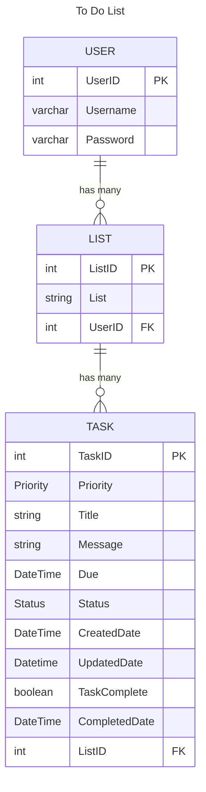

```mermaid
---
title: To Do List
---
erDiagram

USER {
    int UserID PK
    varchar Username
    varchar Password
}
USER ||--o{ LIST : "has many"
LIST {
    int ListID PK
    string List
    int UserID FK
}

LIST ||--o{ TASK : "has many"
TASK {
    int TaskID PK
    Priority Priority
    string Title
    string Message
    DateTime Due
    Status Status 
    DateTime CreatedDate
    Datetime UpdatedDate
    boolean TaskComplete
    DateTime CompletedDate
    int ListID FK
}


```
